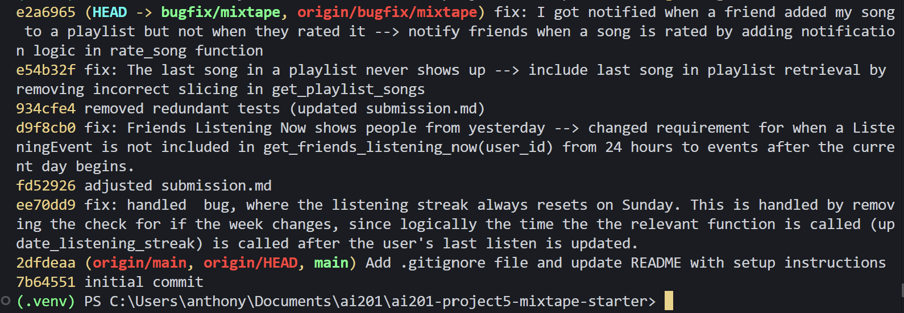

# AI Usage
1. I asked Claude to generate additional test cases to test bug #2 (Friends Listening Now) to help identify where the bug is. It returned the `test_listening_now_excludes_listen_from_yesterday` test, which upon running, fails before applying the fix. I read through the code logic and verified that the test case runs as intended. I removed additional tests Claude generated since I didn't want to run on a false positive for other potential bugs in the code. 

2. I asked Claude to generate curl commands to look into bug 4: `I got notified when a friend added my song to a playlist but not when they rated it.`. It originally gave me a version that I couldn't run one by one, so I asked Claude to update it to make sure I can run everything in one line. Afterward, I noticed that it was making use of another function (adding to a playlist), which is something the bug did not encompass. After removing this, I adjusted the curl commands to only check Darius's inbox after Nova submits a rating. I also used Claude to help change the randomized UUIDs after re-seeding the data when testing changes. 


# Commit History


# Codebase Map

## Routes

`routes/feed.py` provides the following API endpoints:
1. `/feed/<user_id>/listening-now`: which calls `get_friends_listening_now(user_id)`, This function is found in `feed_services.py` and queries the database for a list of friends who have listened to a song recently and which song they have listened to. This is accomplished by returning a dict with the user, the timestamp of when the user listenes to the song, and the most recent song they have listened to. I noticed that the function queries by the user's friends, and filters users and their most recent listened song. This exists to help prevents duplicates.

2. `/feed/<user_id>/activity`: which calls `get_activity_feed(user_id)`. This function is also found in `services/feed_services.py`. The function aims to return a general activity feed of recent events. This function is not filtered by recently, but returns the most recent N events regardless of when they happened. The returned list is a list of activites sorted by recency. The function queries for Listing Events, filtered by the user, ordered by `listened_at` up until the limit. Something I found interesting is that the function is still sorted by the friends of the user, but allows for duplicate values, thus must friends should be able to appear within the same query. 

`routes/playlist.py` routes API requests the following paths to their respective functions in `services/`:
1. `POST/playlist/` : allows the user to create a playlist. The data is filtered originally before entering the `create_playlist` function in `services/playlist_service.py`. When creating a playlist, the database checks if the user exists and then adds the playlist to the playlist table. Something I noticed is that the user can have the same name by the same user. I'm curious to if this would cause a bug if the name and user that is shared between two playlists occur. This is probably handled by the `playlist_id` column though in `models.py`.

2. `/playlist/<playlist_id>` retrieves the playlist metadata by querying the database in the playlist table by the playlist_id through the `get_playlist(playlist_id)` function in `/services/playlist_service.py`. It returns the entire row (as a dict) of the queried playlist. 

3. `/playlist/<playlist_id>/songs` allows the obtain an ordered list of songs within the selected playlist. This is accomplished through `get_playlist_songs(playlist_id)` in `playlist_service.py`. They are sorted in the order they are added. The order is handled when the song is added in `services/notification_service.py`. Which simply appends to the end of the list within the song list column of the playlist table.

4. `POST/playlist/<playlist_id/songs>` allows the user to add songs to their playlist through the `add_to_playlist(playlist_id, song_id, added_by)` function found in `services/notification_service.py`. This function checks if every parameter exists in the song, user, and playlist tables. Additionally, it adds the song to the playlist if all of these are valid. Something I am surprised about is that the function does not handle if the playlist is collaborative or not, which should impact if the user is allowed to add to the playlist or not. It offers a notifiaciton to the user if this happens, but doesn't check if the playlist is collaborative or not. Additionally the notificaiton is called through `create_notification` which lives in `services.notification_service.py`.

`routes/songs.py` offer routes for individual songs for the following endpoints:
1. `/songs/search` which calls `search_songs(query)` in `service/search_services.py`. This function queries the Song database by the song title or the artist's name. The function returns a list of song dicts, which include list of tags of tag name strings. 

2. `/songs/<song_id>` calls `get_song(song_id)` in `service/search_services.py`. This retrieves the song based on it's unique id in the Song database table. It retrieves the entire row of  the song.

3. `POST/songs/<song_id>/rate` adds a rating to the Rating table of the database. The interaction is handled through `rate_song(user_id: str, song_id: str, score: int) -> Rating:` found in `services/notification_service.py`. I would have imagined this to be included as a list in Songs, but the Ratings table additionally includes the user who rated it. It allows the user to add a new rating to a song on a score between 1-5. If the user already has a rating, the rating's score column is updated with the new score. If the rating already exists is queried first, based on the user's id and song's id. 

4. `POST/songs/<song_id>/listen` updates the database when the user listens to a song. The interaction is handled in `record_listening_event(user_id, song_id)`, found in `services/streak_service.py`. This function adds to the ListeningEvent table, with the user id, song id, and time of calling the endpoint. Then the user's listening streak is updated, calling `updpate_listening_streak(user,now)`, found in the same file, to update the string based on the following rules:

```  
- If the user hasn't listened before: streak starts at 1.
- If the user already listened today: no change.
- If the user listened yesterday: streak increments by 1.
- If more than one day has passed: streak resets to 1.
```

The function utilizes today's date, then checks when the user has last listened to a song, then handles when to change, update, or reset the count based on the  difference in time. One concern of this function is whether this function is called daily, which can cause information to be incorrect if the streak is called and the user has not listened to a song recently, but is called over a day and this route is not called.

`routes/users.py` handles routes related to user information, such as user information, their streak, notifications, and reading notifications.

1. `/users/<user_id>` does not call any function in `service/` it returns the queries for the user based on the id then returns a json of the user.

2. `/users/<user_id>/streak` calls `get_streak(user_id)` in `services/streak_service.py` The function queries the user in the User table, then returns their listening_streak column. I am concerned about if the user leaves the app for a longer period of time (over 24 hours), and then later their streak is queried. I'm concerned if the information returned is not correct in this scenario. 

3. `/users/<user_id>/notifications` returns a list of notificaitons. Based on the query, the user can choose to only retrieve their unread notifications or not. The returned list is ordered by recency. This is handled in `services/notification_service.py`'s `get_notifications(user_id, unread_only)` function. The only notificaitons that are retrived is if the user adds to a playlist they did not create, in `add_to_playlist`, found in the same file. 

4. `POST/notifications/<notification_id>/read` allows the database to change the `read` column of the `notifications` table (structured in `models.py`) through the `mark_as_read(notification_id)` function found in `services/notification_service.py`. This function queries the notification by id in the notification table, then updates the notificaiton to True. This affects `get_notifications` (and by extension `/users/<user_id>/notificaitons/`) as notifications are read can not appear if `unread_only` is marked as True as a parameter of the function.

# Root Cause Analysis

## 1: My listening streak keeps resetting

### How you reproduced it 

The bug is produced through a test case found in `tests/test_streaks.py`. In the test case, the user's listening streak should update on sunday, however the listening_streak does not update (or resets). 

### How you found the root cause 

The root cause was found by running pytest in bash, which showcased the `test_streak_increments_on_sunday` test failing, which lead me to investigate this error. I found the error by asking Claude where any issues could lead to, which lead me to the `.weekday()` function, which returns 0-6 based on Monady-Snuday of the week. Upon looking further into the code, I realized that the streak always resets on Sunday, which is not intentional behavior but is expected based on the code.

### The root cause 

In the following block of code in `services/streak_service.py`, the only check whether the user's listening streak is updated:
```     
elif days_since_last == 1 and today.weekday() != 6:
        user.listening_streak += 1
```

does not allow the streak to be updated if it is Sunday (weekday() == 6). This is a problem as since this elif statement never returns true in the current scenario, it always resets to 0.


### Your fix and side-effect check 

By removing `today.weekday() != 6:` and changing the line to `elif days_since_last == 1:` only, we are able to correct the error. It's important to recognize that the current date should always be after or on the same day as the the previous listen, thus the weekday check is not neccessary. Additioinally, the streak only affects `POST/songs/<song_id>/listen` (where the function is called) and `/users/<user_id>/streak`, which simply only returns the user's streak. Therefore, there isn't much interaction between other relevant paths with the current streak and is only manipulated under the POST endpoint. 

## 2 Friends Listening Now shows people from yesterday

### How you reproduced it 
I asked Claude to generate a test case that would help trigger an error based on the issue description. After verifying the test case logically works as anticipated, I ran the test case through `pytest` and saw the error generated.

### How you found the root cause 
After finding the relevant function `get_friends_listening_now` in `services/feed_service.py`, I read through the code's logic. I assumed the issue was related to how the cutoff is calculated, since this would be the part of the code that determines if the ListeningEvent is included or not. After investigating the logic, I thought about changing the logic to better fit what the function is inteneded to do semantically, rather than a 24hr check, as 'yesterday' signifies the previous day, which can be within the past 24 hours.

### The root cause 
In `services/feed_service.py`, the function `get_friends_listening_now`, calculates the cutoff of listening events of the current day incorrectly. The code currently retrives current users within the past 24 hours, however, it should be within only the current day, which is dependent on the user's current time subtracted by how many hours has lapsed during the current day, instead of the past 24 hours. 

```
RECENT_THRESHOLD = timedelta(hours=24)
...
cutoff = datetime.now(timezone.utc) - RECENT_THRESHOLD
```


### Your fix and side-effect check 
The cutoff is now calculated by calculating when the current day begins in `services/feed_service.py`. 

```
    now = datetime.now(timezone.utc)
    today_start = now.replace(hour=0, minute=0, second=0, microsecond=0)
```

and adjusting the filter accordingly

```
        .filter(
            ListeningEvent.user_id.in_(friend_ids),
            ListeningEvent.listened_at >= today_start,
        )
```

The updated change adjusts the cutoff to when the current day begins, which only allows ListeningEvents who have listened on or after the current day 00:00:00:00 (HH:MM:SS:MS).

The bug was tested by rerunning pytest to see if the generated test works. Additionally, the changed function only affects `/feed/<user_id>/listening-now`, which makes this changed fairly contained within this change only. Especially since, `get_activity_feed()` found in the same file as the fixed function operates agnostic of any cutoff and the `/feed/<user_id>/listening-now` endpoint.  

## 5 The last song in a playlist never shows up

### How you reproduced it 

The bug appears after running pytest and showcases the test `test_playlist_returns_songs_in_order` in `tests/test_playlist.py` failing. After reading through the test, I saw that `Track 5` is not included in the left list when asserting (gneerated from `get_playlist_songs`). 

```
E           AssertionError: assert ['Track 1', '...3', 'Track 4'] == ['Track 1', '...4', 'Track 5']
E
E             Right contains one more item: 'Track 5'
E             Use -v to get more diff
```

after running pytest -vv it showcases Track 5 not included. 

```
  Right contains one more item: 'Track 5'
  
  Full diff:
    [
        'Track 1',
        'Track 2',
        'Track 3',
        'Track 4',
  -     'Track 5',
    ]
```

### How you found the root cause 
I read through the test case and found `get_playlist_songs(playlist_id)` being used. After looking for the function in `services/playlist_search.py`, I read through the code logic. Based on previous bug errors, I assumed that there is an issue with the cut off with the search. I went ahead and looked for where any filtering occurs in the query and the return statement of the code.

## The root cause

```
    return [song.to_dict() for song in songs[:-1]]

```

is the problematic line that causes the bug. This line upon returning accidently cuts off the last song that is queried, which is not intentional. I think a possible reason for this to happen is if the user needed to reverse the order of the returned list, but that is already handled by `.order_by(asc(playlist_entries.c.position))` in the query. Thus, reversing is also not required. Additionally, the way the playlists are indexed in the list is in the format `[start:end:step]`, and step previously was `-1`, which removed the last element when indexing the songs list. 

### Your fix and side-effect check 

Therefore, to fix the change, I removed the indexing in `get_playlist_songs` so the line now looks like 

```
    return [song.to_dict() for song in songs]
```

To test, I reran pytest to determine if `test_playlist_returns_songs_in_order` is resolved. The changes causes this test to pass, including `test_playlist_returns_all_songs` to additionally pass. This means the bug that caused these to fail initially were shared. To determine side-effect checks, I looked into where `get_playlist_songs` is used, which is additionally referenced in `notification_services.py`. However, the function is not used within the service. Thus, the change is contained within a specific use case, which is the `GET /playlists/<id>/songs` pipeline, which the related tests in pytest aims to check for.

## 4. I got notified when a friend added my song to a playlist but not when they rated it

### How you reproduced it 
I asked Claude to produce the following commands, simulating the interaction:
```
# Check Darius's notification inbox
curl.exe -s "http://127.0.0.1:5000/users/d4fd9739-839d-4e96-a797-0d58ba529380/notifications"

# Nova submits a rating 
curl.exe -s -X POST "http://127.0.0.1:5000/songs/0a2f5267-4811-43f7-a6f4-c6fe549f2883/rate" -H "Content-Type: application/json" -d '{"user_id": "ee172cec-babd-4954-ad85-336e1bd158b3", "score": 5}'

# Darius checks his inbox again.
curl.exe -s "http://127.0.0.1:5000/users/d4fd9739-839d-4e96-a797-0d58ba529380/notifications"

```

Darius's notification count stays the same even though Nova submitting a rating should update Darius's inbox.

### How you found the root cause 

I found the relevant function `rate_song(user_id: str, song_id: str, score: int) -> Rating:` in `services\notification_service.py`. After reading through the function, I noticed that the function did not submit a notification. This is probably the root cause of the error

### The root cause
The `rate_song` function was missing the ability to send a notification to the rater's friends. 

### Your fix and side-effect check

I added functionality to the `rate_songs` function to be able to send a notification to the friends of the rater.
```
    for f in rater.friends:
        create_notification(
            user_id= f.id,
            notification_type="song_rated",
            body=f"{rater.username} rated your song '{song.title}' {score}/5.",
        )
```

The fix aims to ensure the friends of the rater recieves a the relevant notification.

I reran the tests that found the error and re-seeded the data (updating the curl commands).

```
$ curl.exe -s "http://127.0.0.1:5000/users/d4fd9739-839d-4e96-a797-0d58ba529380/notifications"
{"count":5,"notifications":[{"body":"nova rated your song 'Midnight Drive' 3/5.","created_at":"2026-07-05T23:30:06.790913","id":"a74620e6-604e-4a70-8345-f57143ba204b","read":false,"type":"song_rated","user_id":"d4fd9739-839d-4e96-a797-0d58ba529380"},{"body":"nova rated your song 'Midnight Drive' 4/5.","created_at":"2026-07-05T23:29:59.207160","id":"ca77dbaa-74ed-4412-83a2-3ed975769973","read":false,"type":"song_rated","user_id":"d4fd9739-839d-4e96-a797-0d58ba529380"},{"body":"nova rated your song 'Midnight Drive' 4/5.","created_at":"2026-07-05T23:29:34.741805","id":"67fede41-fda3-46f6-aadd-5713ac92dd80","read":false,"type":"song_rated","user_id":"d4fd9739-839d-4e96-a797-0d58ba529380"},{"body":"nova rated your song 'Midnight Drive' 5/5.","created_at":"2026-07-05T23:29:05.606119","id":"fc6a1829-fe6b-41fe-900d-2c8177751039","read":false,"type":"song_rated","user_id":"d4fd9739-839d-4e96-a797-0d58ba529380"},{"body":"nova rated your song 'Midnight Drive' 5/5.","created_at":"2026-07-05T23:28:09.590827","id":"8adda471-8ab9-497f-8ce6-d996c60459fb","read":false,"type":"song_rated","user_id":"d4fd9739-839d-4e96-a797-0d58ba529380"}]}
((.venv) ) 
anthony@DESKTOP-JJCCQAU MINGW64 ~/Documents/ai201/ai201-project5-mixtape-starter (bugfix/mixtape)
$ curl.exe -s -X POST "http://127.0.0.1:5000/songs/0a2f5267-4811-43f7-a6f4-c6fe549f2883/rate" -H "Content-Type: application/json" -d '{"user_id": "ee172cec-babd-4954-ad85-336e1bd158b3", "score": 1}'
{"id":"89393137-a98b-4623-99ce-35c70a634fe3","rated_at":"2026-07-05T23:28:09.547596","score":1,"song_id":"0a2f5267-4811-43f7-a6f4-c6fe549f2883","user_id":"ee172cec-babd-4954-ad85-336e1bd158b3"}
((.venv) ) 
anthony@DESKTOP-JJCCQAU MINGW64 ~/Documents/ai201/ai201-project5-mixtape-starter (bugfix/mixtape)
$ curl.exe -s "http://127.0.0.1:5000/users/d4fd9739-839d-4e96-a797-0d58ba529380/notifications"
{"count":6,"notifications":[{"body":"nova rated your song 'Midnight Drive' 1/5.","created_at":"2026-07-05T23:31:04.406133","id":"37af8d2a-862e-4e9a-935a-e04ee0c4f48a","read":false,"type":"song_rated","user_id":"d4fd9739-839d-4e96-a797-0d58ba529380"},{"body":"nova rated your song 'Midnight Drive' 3/5.","created_at":"2026-07-05T23:30:06.790913","id":"a74620e6-604e-4a70-8345-f57143ba204b","read":false,"type":"song_rated","user_id":"d4fd9739-839d-4e96-a797-0d58ba529380"},{"body":"nova rated your song 'Midnight Drive' 4/5.","created_at":"2026-07-05T23:29:59.207160","id":"ca77dbaa-74ed-4412-83a2-3ed975769973","read":false,"type":"song_rated","user_id":"d4fd9739-839d-4e96-a797-0d58ba529380"},{"body":"nova rated your song 'Midnight Drive' 4/5.","created_at":"2026-07-05T23:29:34.741805","id":"67fede41-fda3-46f6-aadd-5713ac92dd80","read":false,"type":"song_rated","user_id":"d4fd9739-839d-4e96-a797-0d58ba529380"},{"body":"nova rated your song 'Midnight Drive' 5/5.","created_at":"2026-07-05T23:29:05.606119","id":"fc6a1829-fe6b-41fe-900d-2c8177751039","read":false,"type":"song_rated","user_id":"d4fd9739-839d-4e96-a797-0d58ba529380"},{"body":"nova rated your song 'Midnight Drive' 5/5.","created_at":"2026-07-05T23:28:09.590827","id":"8adda471-8ab9-497f-8ce6-d996c60459fb","read":false,"type":"song_rated","user_id":"d4fd9739-839d-4e96-a797-0d58ba529380"}]}
((.venv) ) 
```

There are no side-effect changes as the relevant functions (`create_notification` and `rate_song`) are retrieved within their own respecitve endpoints (`POST/songs/<song_id>/rate` and `/<user_id>/notifications"`) Adding a song to a playlist is not affected as `create_notification` is not changed, only included into `rate_song`. I was sure to create different messages between adding to a playlist and rating a song to ensure it is clear that both are seperate.

# Regression test

I used a regression test to look for the bug in Friends Listening Now shows people from yesterday: 
``` 
def test_listening_now_excludes_listen_from_yesterday(app, friends):
    """
    A friend who listened late yesterday (a different calendar day than
    today, regardless of what time this test runs) should NOT show up as
    listening now. Fails today because RECENT_THRESHOLD is a rolling 24h
    window rather than "today", so a listen from yesterday at 11:59pm is
    still within the window and incorrectly shows as "listening now".
    """
    with app.app_context():
        now = datetime.now(timezone.utc)
        yesterday_date = (now - timedelta(days=1)).date()
        listened_at = datetime.combine(yesterday_date, time(23, 59), tzinfo=timezone.utc)
        _listen(friends["friend"].id, friends["song"].id, listened_at)

        feed = get_friends_listening_now(friends["viewer"].id)
        friend_ids = [entry["friend"]["id"] for entry in feed]
        assert friends["friend"].id not in friend_ids  # Should be excluded, bug includes it
```
